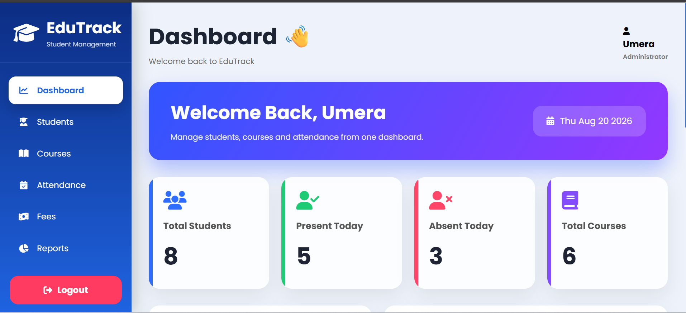
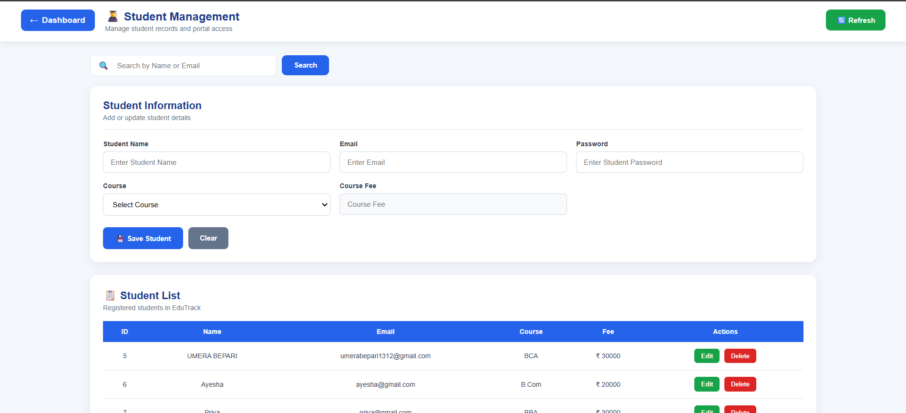
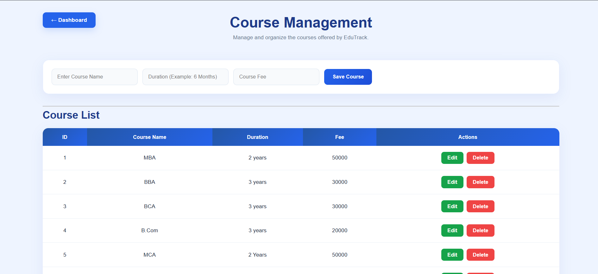
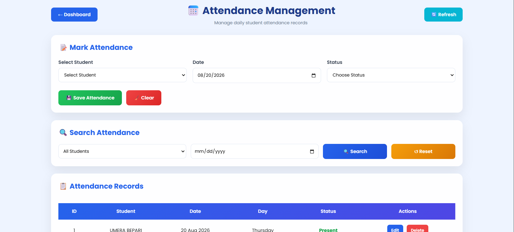
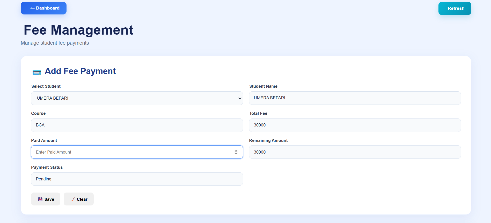
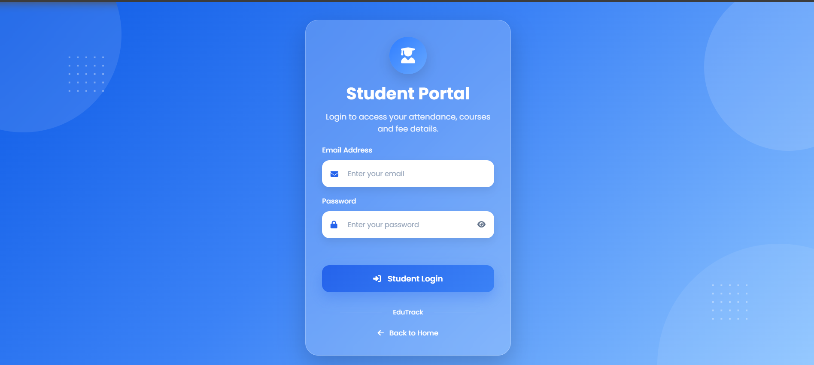
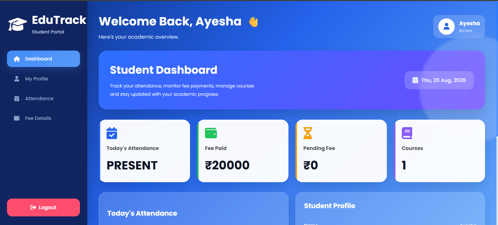
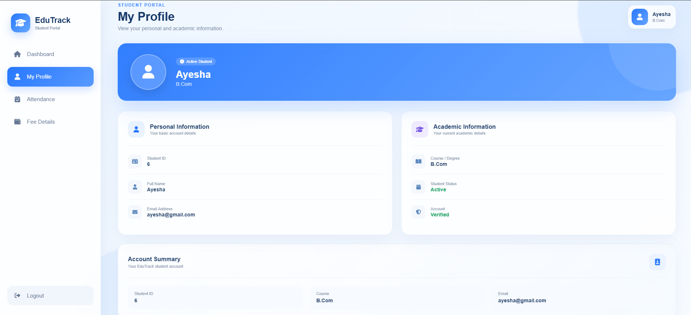
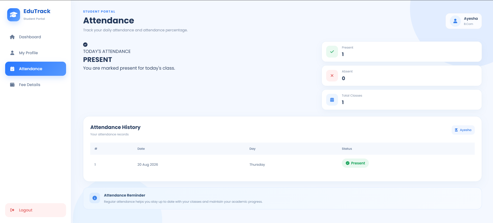
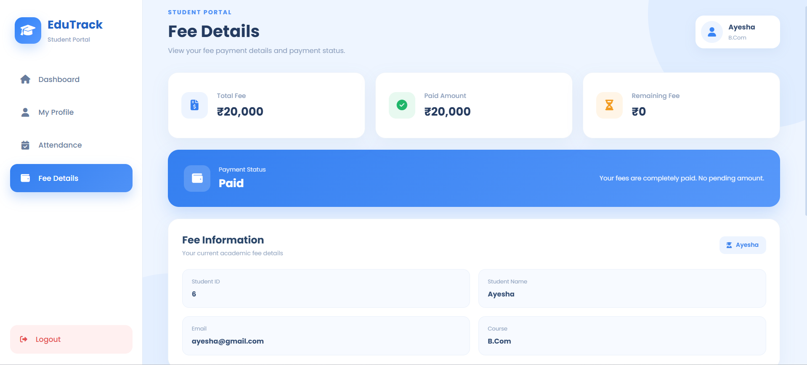

# 🎓 EduTrack - Student Management System

A full-stack **Student Management System** built using **Spring Boot, Spring Data JPA, Hibernate, MySQL, HTML, CSS and JavaScript**.

EduTrack provides separate **Admin and Student portals** to manage students, courses, attendance and fee details through a clean and responsive web interface.

---

## 📌 About The Project

**EduTrack** is a beginner-friendly full-stack Java project designed to demonstrate how a real-world Student Management System can be developed using **Spring Boot REST APIs** and a **frontend built with HTML, CSS and JavaScript**.

The system provides role-based access for:

- 👨‍💼 **Admin**
- 🎓 **Student**

The Admin can manage student information, courses, attendance and fees, while students can log in to their own portal and view their personal information, attendance and fee details.

---

## ✨ Features

### 👨‍💼 Admin Portal

- 🔐 Admin Login
- 👤 Dynamic Admin Name
- 📊 Admin Dashboard
- 🎓 Student Management (Add / Update / Delete / Search)
- 📚 Course Management (Add / Update / Delete)
- 📅 Attendance Management (Mark / Update / Delete / Search / Date-wise, Duplicate Prevention)
- 💰 Fee Management (Add / Update / Delete / Search, Automatic Remaining Fee Calculation, Payment Status Tracking)
- 🔄 Refresh Functionality
- 🚪 Admin Logout

### 🎓 Student Portal

- 🔐 Student Login
- 👤 Dynamic Student Information
- 🏠 Student Dashboard
- 📋 My Profile
- 📅 Attendance Details (Percentage, Present/Absent Days, History)
- 💰 Fee Details (Paid Fee, Remaining Fee)
- 📚 Course Information
- 🚪 Student Logout
- 🔄 Dynamic data based on logged-in student

---

## 🛠️ Technologies Used

### Backend
- ☕ Java
- 🌱 Spring Boot
- 🌱 Spring Data JPA
- 🔄 Hibernate ORM
- 🌐 REST APIs
- ✅ Jakarta Validation
- 🗄️ MySQL
- 📦 Maven

### Frontend
- 🌐 HTML5
- 🎨 CSS3
- ⚡ JavaScript
- 🎯 Font Awesome
- 📊 Chart.js
- 🔤 Google Fonts

### Development Tools
- 💻 Eclipse IDE
- 🗄️ MySQL Workbench
- 🧪 Postman
- 🔧 Git
- 🐙 GitHub

---

## 🏗️ Project Architecture

```
Frontend
   │  HTTP Requests
   ▼
Spring Boot REST Controllers
   ▼
Service Layer
   ▼
Repository Layer
   ▼
Hibernate / JPA
   ▼
MySQL Database
```

---

## 📂 Project Structure

```
EduTrack-Student-Management-System/
│
├── backend/
│   ├── src/
│   │   ├── main/
│   │   │   ├── java/com/edutrack/studentmanagement/
│   │   │   │   ├── authentication/   (Admin.java, AdminController, AdminRepository, AdminService)
│   │   │   │   ├── attendance/       (Attendance.java, AttendanceController, AttendanceRepository, AttendanceService)
│   │   │   │   ├── controller/       (StudentController.java)
│   │   │   │   ├── entity/           (Student.java)
│   │   │   │   ├── fee/              (Fee.java, FeeController, FeeRepository, FeeService)
│   │   │   │   ├── repository/       (StudentRepository.java)
│   │   │   │   ├── service/          (StudentService.java)
│   │   │   │   └── studentauth/      (StudentLoginController, StudentLoginRequest)
│   │   │   └── resources/
│   │   │       └── application.properties
│   │   └── test/
│   └── pom.xml
│
├── frontend/
│   ├── admin-login.html / .css / .js
│   ├── dashboard.html / .css / .js
│   ├── student.html / .css / .js
│   ├── course.html / .css / .js
│   ├── attendance.html / .css / .js
│   ├── fee.html / .css / .js
│   ├── student-login.html / .css / .js
│   ├── student-dashboard.html / .css / .js
│   ├── student-profile.html / .css / .js
│   ├── student-attendance.html / .css / .js
│   └── student-fee.html / .css / .js
│
└── README.md
```

*The exact folder names may vary depending on the final project organization.*

---

## 🗄️ Database

The application uses **MySQL** as the relational database.

**Main Tables:** `admin`, `student`, `course`, `attendance`, `fees`

| Table | Stores |
|---|---|
| Student | Student ID, Name, Email, Course, Fee, Password |
| Course | Course ID, Course Name, Course Fee |
| Attendance | Attendance ID, Student ID, Date, Status |
| Fee | Fee ID, Student ID, Student Name, Course, Total Fee, Paid Amount, Remaining Amount, Payment Status |
| Admin | Admin ID, Admin Name, Email, Password |

---

## 🔐 Authentication

EduTrack provides separate login systems for Admin and Student.

```
Admin Login → Spring Boot REST API → Database Verification → Admin Dashboard
Student Login → Spring Boot REST API → Database Verification → Student Dashboard
```

After successful login, the logged-in user's information is stored on the frontend and used to display dynamic data.

---

## 📊 Admin Dashboard

Displays dynamically generated information such as:
- 👥 Total Students
- 📚 Total Courses
- ✅ Present Students / ❌ Absent Students
- 📈 Attendance Chart
- 🧑‍🎓 Recent Students
- 📅 Recent Attendance
- 💰 Recent Fee Records

The dashboard retrieves information from the Spring Boot REST APIs instead of using static data.

---

## 📅 Attendance Management

The Admin can mark, update, delete, and search attendance by student or date, and view attendance history.

**Duplicate Prevention:** the system prevents multiple attendance records for the same Student + Date combination (e.g. Student ID 6 on 2026-08-08 can have only one record), preventing accidental duplicate entries.

---

## 💰 Fee Management

The fee module automatically calculates:

```
Remaining Fee = Total Fee - Paid Amount
```

Payment status is determined automatically as **Paid**, **Pending**, or **Partial**.

Example:
```
Total Fee     = ₹50,000
Paid Amount   = ₹45,000
Remaining Fee = ₹5,000
Status        = Partial
```

---

## 🎨 User Interface

- Responsive layouts
- Sidebar navigation
- Dashboard cards & tables
- Forms with search functionality
- Status badges & action buttons
- Font Awesome icons, Google Fonts, Charts

The Admin and Student dashboards use separate interfaces based on their respective roles.

---

## 📸 Application Screens

### Admin Portal







### Student Portal






---

## 🔗 REST API Endpoints

**Student APIs**
```
GET     /students
GET     /students/{id}
POST    /students/save
PUT     /students/update
DELETE  /students/delete/{id}
GET     /students/count
```

**Student Authentication**
```
POST    /student/login
```

**Attendance APIs**
```
GET     /attendance
GET     /attendance/{id}
POST    /attendance/save
PUT     /attendance/update
DELETE  /attendance/delete/{id}
GET     /attendance/student/{studentId}
GET     /attendance/date/{date}
GET     /attendance/student/{studentId}/date/{date}
GET     /attendance/present/count
GET     /attendance/absent/count
```

**Fee APIs**
```
GET     /fees
GET     /fees/{id}
POST    /fees/save
PUT     /fees/update
DELETE  /fees/delete/{id}
GET     /fees/student/{studentId}
```

**Admin Authentication**
```
POST    /admin/login
```

---

## ⚙️ Setup & Installation

**1️⃣ Clone the Repository**
```bash
git clone https://github.com/umera13/EduTrack-Student-Management-System.git
cd EduTrack-Student-Management-System
```

**2️⃣ Configure MySQL**

Create a database in MySQL:
```sql
CREATE DATABASE edutrack;
```

Update your Spring Boot configuration in `application.properties`:
```properties
spring.datasource.url=jdbc:mysql://localhost:3306/edutrack
spring.datasource.username=root
spring.datasource.password=YOUR_PASSWORD

spring.jpa.hibernate.ddl-auto=update
spring.jpa.show-sql=true
```
Replace `YOUR_PASSWORD` with your MySQL password.

**3️⃣ Run the Spring Boot Application**

Open the backend project in Eclipse / IntelliJ IDEA / Spring Tool Suite and run the main Spring Boot application. The backend starts at:
```
http://localhost:8080
```

**4️⃣ Run the Frontend**

Open the frontend files using a local development server (e.g. VS Code Live Server: right-click → Open with Live Server), then open `admin-login.html` or `student-login.html`.

---

## 🔑 Login Flow

**Admin:** Admin Login → Admin Authentication → Admin Dashboard → Student / Course / Attendance / Fee Management

**Student:** Student Login → Student Authentication → Student Dashboard → Profile / Attendance / Fee Details

---

## 🧪 Testing

The REST APIs can be tested using Postman, a browser, or the frontend application.

Example:
```
GET http://localhost:8080/students
```

Example response:
```json
[
    {
        "id": 1,
        "name": "Rahul",
        "email": "rahul@gmail.com",
        "course": "Java Full Stack",
        "fee": 50000
    }
]
```

---

## 🚀 Future Improvements

- 🔐 Spring Security
- 🔑 Password encryption using BCrypt
- 🎫 JWT Authentication
- 👥 Role-based authorization
- 📧 Email notifications
- 📱 Better mobile responsiveness
- 📄 PDF report generation
- 📊 Advanced analytics
- 🔎 Advanced search and filtering
- 📈 Student performance reports
- 🗓️ Timetable management
- 📢 Student notifications
- ☁️ Cloud deployment
- 🐳 Docker support

---

## 🎯 Learning Outcomes

Through this project, the following concepts were practiced:
- Java, Spring Boot, REST API development
- Spring Data JPA, Hibernate, Entity mapping
- CRUD operations, MySQL database integration
- Repository pattern, Service layer, Controller layer
- JavaScript Fetch API, Dynamic frontend rendering, Form validation
- Authentication, Local Storage
- MVC architecture
- Git and GitHub
